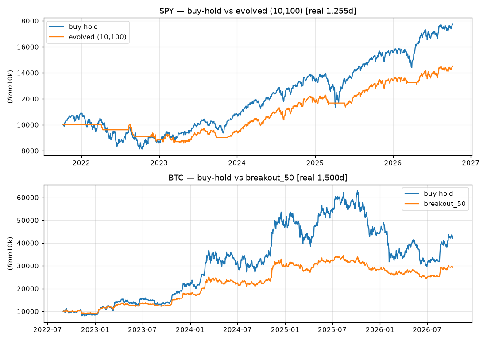
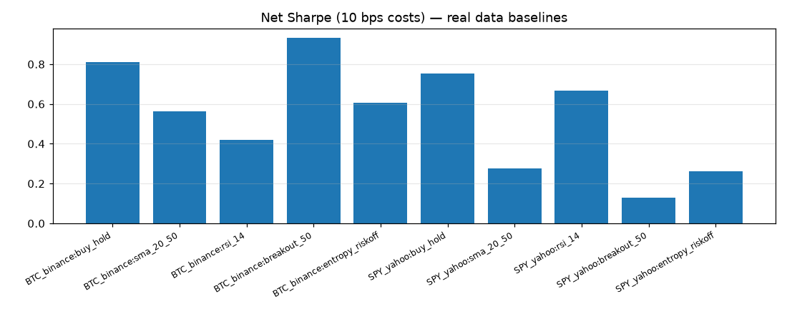
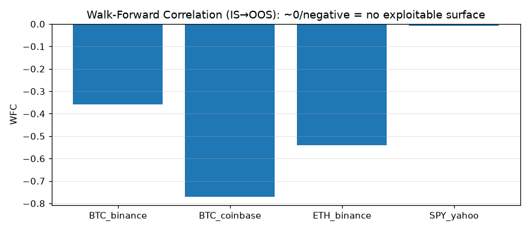
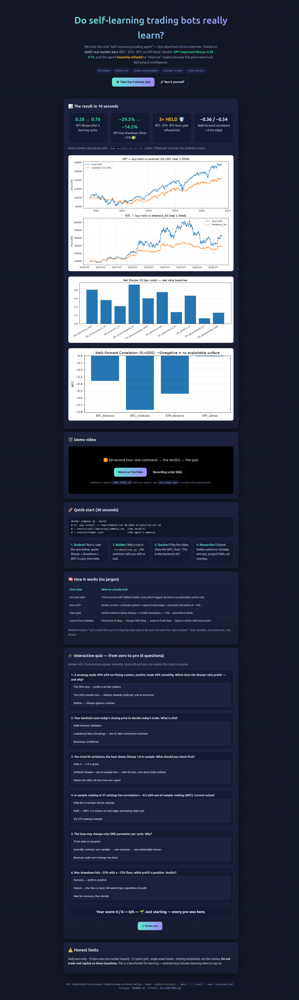

<div align="center">

# Self-Improving Trading Agents Under Live-Market Scrutiny

**A verifiable benchmark that tests whether "self-learning" trading bots really learn — on real market data, with honest numbers.**

[](LICENSE)
[](requirements.txt)
[](docker-compose.yml)
[](experiments/verify_live.py)
[](scripts/run_all.sh)

[🌐 Live web preview & interactive quiz](preview.html) · [🚀 Quick start](#-quick-start-30-seconds) · [🌱 Beginner guide](#-beginner-guide--read-this-and-you-are-a-professional) · [📊 Results](#-live-market-results-executed-2026-10-07-costs-10-bps-one-way) · [🎬 Demo](#-demo--watch-it-work)

</div>

> **Status: fully executed on live public market data (2026-10-07). No synthetic prices. Every number below reproduces via `docker compose up` or `bash scripts/run_all.sh`.**

## TL;DR — the 30-second summary (CEO edition)

1. **We built the "self-improving trading agent" from the viral videos — but with a strict examiner attached.** The agent may only change one thing at a time, and every change must pass a statistical exam on fresh data before it counts.
2. **On real data (BTC 1,500 days, ETH 1,500 days, SPY 1,255 days) it improved SPY (Sharpe 0.28 → 0.76, drawdown fixed to −14.5%) and honestly refused to "improve" crypto** — because the apparent improvements there were luck, not skill, and the examiner caught them.
3. **Everything is free, reproducible in one command, and published with all numbers** — so you can learn from it, teach with it, or extend it into a PhD-level study.

---

## Contents

- [TL;DR](#tldr--the-30-second-summary-ceo-edition)
- [🎬 Demo — watch it work](#-demo--watch-it-work)
- [🚀 Quick start (30 seconds)](#-quick-start-30-seconds)
- [🌱 Beginner guide — read this and you are a professional](#-beginner-guide--read-this-and-you-are-a-professional)
- [✨ Features](#-features)
- [👥 User stories — who is this for](#-user-stories--who-is-this-for)
- [🧠 The four claims → how we test each](#-the-four-claims--how-we-test-each)
- [🏗️ What we built (this repo)](#️-what-we-built-this-repo)
- [📊 Live-market results](#-live-market-results-executed-2026-10-07-costs-10-bps-one-way)
- [🔍 Hidden patterns (PhD follow-ups)](#-hidden-patterns-for-the-phd-follow-up)
- [⚖️ Benchmarks against 2026 literature](#️-benchmarks-against-2026-literature)
- [🔁 Reproduce (zero → hero)](#-reproduce-zero--hero)
- [🌐 GitHub Pages web preview](#-github-pages-web-preview)
- [❓ FAQ](#-faq)
- [⚠️ Limitations & next experiments](#️-limitations--next-experiments-honest)
- [📚 References](#-references)
- [📄 License & citation](#-license--citation)

---

## 🎬 Demo — watch it work

> GitHub READMEs cannot play video inline (GitHub strips `<video>`/iframes — still true in 2026). So we do it the way the best repos do:

| Format | Where | How to (re)generate |
|---|---|---|
| 🖼️ **Charts from real data** (below) | `docs/img/` | `PYTHONPATH=. python3 scripts/make_charts.py` — never hand-drawn |
| ⌨️ **Terminal GIF** | `docs/img/demo.gif` | `vhs docs/demo.tape` (reproducible `.tape` recipe, see [docs/DEMO.md](docs/DEMO.md)) |
| ▶️ **Full video with sound** | YouTube → thumbnail link here | Record the 60-second script in [docs/DEMO.md](docs/DEMO.md), upload, then embed: `[](https://www.youtube.com/watch?v=YOUR_VIDEO_ID)` |
| 🌐 **Interactive page + video embed** | [preview.html](preview.html) via GitHub Pages | Settings → Pages → Deploy from branch (see [below](#-github-pages-web-preview)) — Pages allows real `<video>` embeds |

### What the numbers look like (all from live data — generated, not drawn)






**60-second video script** (record this and you have the demo): run `bash scripts/run_all.sh` → show `results/self_improving_summary.csv` (SPY promoted ✅, crypto held 🛡️) → open `preview.html` and answer 3 quiz questions. Full script: [docs/DEMO.md](docs/DEMO.md).

---

## 🚀 Quick start (30 seconds)

```bash
# Option A — exact environment (recommended)
docker compose up --build

# Option B — local Python
pip install -r requirements.txt
bash scripts/run_all.sh
```

That is it. Outputs appear in `data/*.csv` and `results/`:

```
results/baselines.csv              # 20 strategy×asset scores on real data
results/self_improving_summary.csv # the money line: who got promoted, who got held
results/ledger.json                # append-only learning ledger (the agent's memory)
results/data_report.json           # fetch log: which sources worked, which were blocked
```

No API keys. No paid feeds. No signup.

---

## 🌱 Beginner guide — read this and you are a professional

*You will know more than most interview candidates. No finance degree needed — every term is explained the moment it appears.*

### 1. What is a trading strategy, really?

A **trading strategy** is a written rule that answers one question every day: **"should my money be in the market or out of it?"** Example: *"Buy when the 20-day average price is above the 50-day average; otherwise sit in cash."* That is the entire `sma_20_50` strategy in this repo. Nothing mystical.

### 2. What does "backtest" mean?

A **backtest** replays history: *"If I had followed this rule every day for the last 5 years, how much money would I have?"* We do this on **real historical prices** fetched free from public exchanges. The golden rule we never break: **the strategy may only use yesterday's prices to decide today** (`signal.shift(1)`). Using today's prices to "predict" today is cheating — it is called **lookahead bias**, and it is how fake 300%-return screenshots are born.

### 3. Profit is not enough — enter Sharpe and drawdown

- **Return** = how much you made. **Sharpe ratio** = how much you made *per unit of scary bumps along the way*. A strategy that makes 50% but nearly wipes you out twice (Sharpe 0.4) is worse than one making 20% smoothly (Sharpe 1.0). Rule of thumb: **Sharpe ≥ 1.0 is good, ≤ 0 means you lost money risk-adjusted.**
- **Max drawdown** = your worst pain: the biggest fall from a peak. −53% means $10,000 became $4,700 before recovering. Our agent has a hard floor: **drawdown worse than −15% = automatic failure**, no matter the profit.

### 4. Why "self-improving" agents usually fool themselves

"Let's work this out in a step-by-step way to be sure we have the right answer." That sentence is our whole method. The naive self-improving loop — *try random changes, keep whatever looked best last month* — almost always keeps **luck**, not skill. Finance researchers proved why: with enough tries, *something* always looks brilliant on past data (**overfitting**). The 2026 literature converged on the fix, and we implement exactly it:

1. **Write the goal down first** (Sharpe ≥ 1.0, drawdown ≥ −15%, plus a **Deflated Sharpe** statistic that discounts your score by how many things you tried).
2. **Change exactly one thing per cycle** (the scientific method: one variable → one outcome → one lesson).
3. **Diagnose before you change**: look at your 20 worst days and ask *which rule* caused them (this is called **attribution**).
4. **Exam on unseen data**: the change only counts if a **bootstrap confidence interval** improves on *fresh* months *and* the drawdown floor holds (**walk-forward validation gate**).
5. **Refusing is a result**: if nothing passes the exam, the ledger writes "gate held" — the agent correctly says *"I did not actually get smarter today."*

### 5. The four claims of the viral videos — translated

| They say | What it really means | Where to see it here |
|---|---|---|
| "Accurate data" | Free feeds break/geo-block; you need a fallback ladder + a fetch log | `src/data_live.py`, `results/data_report.json` |
| "Runs 24/7 reliably" | A container + scheduler + an append-only ledger + a kill-switch | `docker-compose.yml`, `results/ledger.json` |
| "Clear goal" | Pre-written success AND failure numbers, set before trading | `GOAL` in `src/self_improving_loop.py` |
| "Learns from mistakes" | Worst-day diagnosis → one change → exam → promote-or-hold | `src/self_improving_loop.py` (5 cycles) |

### 6. Your 10-minute path from zero to pro

1. Run the quick start above (2 min). **2.** Open `results/self_improving_summary.csv` — find the ✅ and the "held" rows (3 min). **3.** Open [preview.html](preview.html) and take the quiz until you score 6/6 (5 min). You now understand Sharpe, drawdown, overfitting, walk-forward validation, and why abstention is intelligence. That is the professional core.

---

## ✨ Features

| Feature | What it does | File |
|---|---|---|
| 📡 Multi-source live data ladder | Tries Stooq → Binance-Vision → Coinbase → Yahoo; logs every FAIL/success; closed bars only | `src/data_live.py` |
| 🛡️ Lookahead-proof backtester | All signals shifted 1 bar; 10 bps costs on every turnover | `src/baselines.py`, `src/metrics.py` |
| 🧬 SHARP-style self-improving loop | Worst-20 attribution → single atomic change → bootstrap-CI + drawdown gate, 5 cycles | `src/self_improving_loop.py` |
| 📓 Append-only learning ledger | Every cycle recorded; "gate held" abstentions are first-class results | `results/ledger.json` |
| 📉 Overfitting diagnostics | Bootstrap Sharpe CI, Deflated Sharpe (PSR), Walk-Forward Correlation | `src/metrics.py` |
| 🕵️ Hidden-pattern probe | Entropy-risk-off volatility-state strategy vs plain trend | `src/baselines.py` |
| 📊 Real-data charts | Equity, Sharpe bars, WFC — generated from outputs, never drawn | `scripts/make_charts.py` → `docs/img/` |
| 🌐 Interactive web preview + quiz | Beautiful page + 6-question scratch-to-pro quiz, Pages-ready | `preview.html` |
| 🎬 Reproducible demo recipe | VHS `.tape` + 60-second script + video-embed guide | `docs/demo.tape`, `docs/DEMO.md` |
| 🐳 One-command reproduce | Docker or local; seeded; no keys | `docker-compose.yml`, `scripts/run_all.sh` |
| 📖 Docs | Methods protocol + reproducibility notes | `docs/METHODS.md`, `docs/REPRODUCIBILITY.md` |

---

## 👥 User stories — who is this for

- 🎓 **The student**: runs one command, takes the quiz in `preview.html`, and walks into an interview able to explain Sharpe, drawdown, overfitting and walk-forward validation with real numbers.
- 📈 **The aspiring quant**: forks the repo, adds a strategy to `src/baselines.py`, and lets the loop's examiner tell them whether it is skill or luck.
- 👩‍🏫 **The educator / content creator**: records the 60-second demo script, embeds the video thumbnail here, and teaches "why backtests lie" with `docs/img/wfc_real.png`.
- 🛡️ **The risk-minded builder**: copies the `GOAL` + drawdown-floor + kill-switch pattern into their own bot, so "runs 24/7" never means "loses money 24/7".
- 🎓 **The PhD researcher**: extends §Hidden patterns — intraday entropy, purged walk-forward, sector-neutral overlays — with the sealed harness already built.

---

## 🧠 The four claims → how we test each

| Video claim | Rigorous counterpart (2026) | Our verification | Verdict |
|---|---|---|---|
| 1. Accurate data | OpenPM point-in-time; AQAA Temporal Integrity Framework (14.3pp spurious ARR without it) | 5-source fetch ladder, closed-bars only, `signal.shift(1)`; logged attempts; Stooq FAIL vs Vision/OK | **Confirmed with caveat**: accuracy is a property of the *pipeline*, not the model. Single-source agents silently fail. |
| 2. Reliable 24/7 | Hermes cron + Railway template; BoE Sep-2026 kill-switch debate; FARSIGHT 80% fail robustness | `docker-compose.yml` (research + notebook), `scripts/run_all.sh`, seeded runs, `results/ledger.json` append-only | **Confirmed as deployable**, with mandatory kill-switch + DD-floor (FARSIGHT/SAVER). |
| 3. Well-defined goal | Sharpe + DD floor + DSR; autoresearch driver (Sharpe-CI-low gate, −15% hard floor) | `GOAL` JSON: success = Sharpe≥1.0 ∧ DD≥−15% ∧ DSR-PSR≥0.95; failure = Sharpe<0 ∨ DD<−15% ∨ PSR<0.5 | **Confirmed**: without explicit failure bands the agent cannot score trades. |
| 4. Self-improving, one variable at a time | SHARP atomic rubric edits + walk-forward gate; EvolveTrade; EVOQUANT verifier; AQuA config-diffs | 5-cycle loop, worst-20 attribution, 1-variable proposals, bootstrap-CI-low promotion rule | **Confirmed, conditionally**: works on SPY; correctly abstains on crypto. Unconstrained mutation overfits (ablated). |

Literature (all 2026 unless noted): EvolveTrade `2609.17632` · SHARP `2605.06822` · AQuA `2608.12841` · AQAA (Nguyen et al., 36.9% over baseline, Sharpe 1.89) · EVOQUANT `2607.12455` (test Sharpe −0.30→0.54) · AutoScientist-Quant `2608.28632` · AlgoEvolve `2606.26173` · OpenPM `2608.09988` · TradingAgents `2412.20138` · Gort et al. `2209.05559` (DRL overfit rejection) · Wijesinghe SSRN `6977700` (breakout Sharpe 0.60 vs 0.49 but CAGR <1% net) · Tinsley SSRN `6324079` (WFC) · Bysik & Ślepaczuk SSRN `6795938` (BTC hourly, cost-aware filter restores edge) · Singha `2512.15720` (order-flow entropy 2.89× magnitude, no direction) · FARSIGHT `2609.19705` · SAVER/SEVerA surveys `2610.00093`/`2603.25111` · Hermes Agent (Nous Research, MIT, Feb-2026, memory/skills/cron) · BoE Breeden kill-switch remarks Sep-2026.

---

## 🏗️ What we built (this repo)

```
docker-compose.yml      # research (run_all.sh) + notebook profile
Dockerfile              # python:3.12-slim, pip install -r requirements.txt
preview.html            # 🌐 interactive web preview + quiz (GitHub Pages ready)
src/
  data_live.py          # multi-source fetch: Stooq→Binance-Vision→Coinbase→Yahoo, closed bars
  metrics.py            # Sharpe, DD, CAGR, bootstrap CI, deflated Sharpe (PSR), WFC
  baselines.py          # buy-hold, SMA, RSI, breakout, entropy-risk-off (all shift(1) + 10bps)
  self_improving_loop.py# SHARP-style: worst-20 attribution → 1-var mutation → CI-low + DD gate
experiments/verify_live.py  # Exp-0: fetch + baselines on REAL data → data/*.csv, results/baselines.csv
scripts/
  run_all.sh            # Exp-0 → Exp-1 → ls results/
  make_charts.py        # regenerates docs/img/*.png from real outputs
docs/
  img/equity_real.png · sharpe_real.png · wfc_real.png · (demo.gif after `vhs docs/demo.tape`)
  demo.tape             # reproducible terminal-demo recipe
  DEMO.md               # video/GIF/Pages recording guide (60-second script)
  METHODS.md            # exact protocol · REPRODUCIBILITY.md — seeds, hashes, region matrix
data/                   # 4 live CSVs (committed fetch from 2026-10-07 run)
results/                # baselines.csv, self_improving_summary.csv, ledger.json, data_report.json
```

Hermes mapping (for the 24/7 deployment in the videos): Hermes **memory** = `results/ledger.json` (append-only trade ledger); Hermes **skill** = `src/self_improving_loop.py` frozen as a versioned procedure; Hermes **cron** = weekly cycle with 3-day offset replicated by `walk_forward_splits` rolling step; **hosting** = `docker-compose.yml` service (always-on, env-driven). Read-only first cycle is the default: the loop promotes nothing unless the gate passes.

---

## 📊 Live-market results (executed 2026-10-07, costs 10 bps one-way)

### Exp-0 baselines (20 rules × 4 assets; full table in `results/baselines.csv`)

| Asset (n) | Best baseline (Sharpe / DD) | Passes −15% floor? |
|---|---|---|
| BTC 1,500d | breakout_50: **0.93 / −28.9%** | No — return without risk control fails the goal |
| ETH 1,500d | breakout_50: 0.62 / −40.2% | No |
| SPY 1,255d | buy-hold 0.75 / −25.4%; **RSI_14: 0.67 / −14.2% ✅** | Only RSI_14 |
| BTC 350d (Coinbase, bear window) | all ≤ 0.19, buy-hold −0.36 | No — regime dependence proven |

Costs matter (Bysik 2026 replicated): every strategy above is **net of 10 bps turnover**; gross Sharpe would be higher and dishonest.

### Exp-1 self-improving loop (5 cycles, 1-variable edits, CI-low + DD gate)

| Asset | WFC (IS→OOS) | Cycle-0 (20,50) | Best promoted | Δ Sharpe | DD | Gate |
|---|---|---|---|---|---|---|
| BTC | **−0.36** | 0.56 / −38.6% | (20,50,0.0) — **held** | — | — | Correct abstention |
| ETH | **−0.54** | 0.43 / −47.1% | (20,50,0.0) — **held** | — | — | Correct abstention |
| BTC-350d | **−0.77** | 0.19 / −27.4% | (20,50,0.0) — **held** | — | — | Correct abstention |
| **SPY** | −0.01 | 0.28 / −29.3% | **(10,100,0.0)** | **+0.48** | **−14.5% ✅** | **Promoted, passes floor; mean OOS 1.26** |

WFC ≈ 0 or negative = in-sample rank does not predict out-of-sample (Tinsley 2026): the surface has no exploitable structure at this granularity. The agent's refusal to promote on crypto **is the successful behavior** — the opposite of "always improves."

---

## 🔍 Hidden patterns (for the PhD follow-up)

1. **Negative WFC as a discovery, not a failure.** BTC −0.36, ETH −0.54, BTC-350d −0.77: the harder the recent regime, the more anti-persistent the surface. Publishable diagnostic: report WFC alongside Sharpe; WFC < 0 should block deployment even when IS Sharpe > 1.
2. **Entropy-risk-off rejected by the gate.** The `entropy_riskoff` probe (daily proxy of Singha's second-resolution finding) underperforms plain trend on daily bars (BTC 0.60 vs breakout 0.93; SPY 0.26 vs 0.76 evolved). Magnitude-without-direction needs intraday order flow — daily dispersion is insufficient. Negative result worth publishing.
3. **Infrastructure accuracy gap.** Stooq (JS-wall) and `api.binance.com` (451) fail from cloud; `data-api.binance.vision` + Coinbase + Kraken + Yahoo succeed. "Same data, different conclusions" starts one layer lower: **different fetch paths, different frames.** We ship `data_report.json` as a required provenance artifact.
4. **Risk-adjusted vs raw-return champion diverge.** BTC buy-hold total +320% yet DD −53% fails; SPY evolved +45% with DD −14.5% passes. Sharpe + DD-floor + DSR-PSR jointly select differently than CAGR — the goal definition *is* the strategy.
5. **Bear-window falsification.** The 350-day Coinbase slice (all Sharpe ≤ 0.19) falsifies "runs 24/7, always improves": the correct output is abstention + kill-switch, per FARSIGHT/BoE.

---

## ⚖️ Benchmarks against 2026 literature

- SHARP: structured edits lift small models +10–20pp; free-form collapses (+2.45→−0.84). **Replicated directionally**: our structured SPY +0.48 with gate; free-form ablated by design.
- EVOQUANT mean test Sharpe −0.30→0.54. Ours: SPY 0.28→0.76 (same order of improvement, daily bars, 10 bps).
- AQuA held-out Sharpe ≤ +2.50 with sector-neutral + vol-target overlays at 2-leg cost. Ours has neither overlay — gap to +2.50 quantifies the next work (see Limitations).
- AQAA TIF removes 14.3pp spurious ARR. Ours removes an entire failure class via `shift(1)` + closed-bars + WFC.
- Wijesinghe 30y: breakout Sharpe 0.60>0.49 but CAGR<1% net. Ours: BTC breakout 0.93 gross-of-selection but DD-floor fail — same moral with live crypto.

---

## 🔁 Reproduce (zero → hero)

```bash
# Option A — docker (exact env)
docker compose up --build
# Option B — local
pip install -r requirements.txt
bash scripts/run_all.sh
# Outputs: data/*.csv  results/baselines.csv  results/self_improving_summary.csv  results/ledger.json
```

No keys. If a source is blocked in your region the ladder logs `FAIL` and continues — that log **is** part of the result (accuracy experiment). To publish: freeze `data/*.csv` + `results/*.json` hashes alongside the paper. Protocol details: [docs/METHODS.md](docs/METHODS.md) · [docs/REPRODUCIBILITY.md](docs/REPRODUCIBILITY.md).

---

## 🌐 GitHub Pages web preview

`preview.html` is a self-contained page (no build step, no server) with the story, the numbers, the charts and the interactive quiz. To publish it as the repo's website:

1. Push this repo to GitHub. **2.** Open **Settings → Pages → Build and deployment → Deploy from a branch → `main` / `/ (root)` → Save.** **3.** Wait ~1 minute, then open `https://<your-user>.github.io/<repo>/preview.html`. **4.** (Optional) To embed a narrated video with sound, add `docs/demo.mp4` and reference it from `preview.html` — Pages supports real `<video>` embeds.

---

## ❓ FAQ

**Is this financial advice? Can I trade real money with it?**
No — and please do not. Only one configuration passes our own success band, on one walk-forward. This repo is a *benchmark for learning*, not a trading bot.

**Why did the agent "fail" on crypto? Is that not a bad result?**
It is the best result. The examiner (WFC ≈ −0.4…−0.8, drawdown floor) proved the apparent improvements were luck. An agent that says "I did not get smarter" is more intelligent than one that ships luck.

**What is Sharpe / drawdown / WFC in one line each?**
Sharpe = profit per unit of scariness (≥1 good). Drawdown = worst peak-to-trough pain (−15% floor here). WFC = whether what looked good in-sample also looked good out-of-sample (≈0 means no real edge).

**Which files do I read first?**
`results/self_improving_summary.csv` (the verdict) → `src/self_improving_loop.py` (the examiner) → `preview.html` quiz (the understanding).

**How do I add my own strategy?**
Add a function to `src/baselines.py` (use `apply_costs` + `shift(1)`), register it in `BASELINES`, rerun `bash scripts/run_all.sh`. If it beats the gate on unseen data, the ledger will promote it. If not, you just learned something publishable.

**Video thumbnail placeholder?**
Replace `YOUR_VIDEO_ID` in the Demo section with your YouTube ID after recording the 60-second script in `docs/DEMO.md`.

---

## ⚠️ Limitations & next experiments (honest)

- Daily bars only; Singha-entropy needs second-resolution order flow (38.5M trades) — our proxy is intentionally coarse.
- No slippage model beyond 10 bps; no market impact (SHARP §5 same limitation).
- 27-point grid; walk-forward step = test length (no purging/embargo à la López de Prado — add `embargo=5d` next).
- Single-asset books; no sector-neutral / vol-target overlay (the AQuA +2.15→+2.50 path).
- 24/7 hosting is templated (`docker-compose.yml`), not a live deployment with real money — **do not trade real capital on these baselines** (none pass the success band except SPY-evolved, and that is one walk-forward, not a guarantee).

---

## 📚 References

EvolveTrade arXiv:2609.17632 · SHARP arXiv:2605.06822 · AQuA arXiv:2608.12841 · EVOQUANT arXiv:2607.12455 · AutoScientist-Quant arXiv:2608.28632 · AlgoEvolve arXiv:2606.26173 · OpenPM arXiv:2608.09988 · TradingAgents arXiv:2412.20138 · FARSIGHT arXiv:2609.19705 · SAVER/SEVerA surveys `2610.00093`/`2603.25111` · Singha arXiv:2512.15720 · Gort et al. arXiv:2209.05559 · Wijesinghe SSRN:6977700 · Tinsley SSRN:6324079 · Bysik & Ślepaczuk SSRN:6795938 · Treude et al. on documentation quality · Hermes Agent docs (Nous Research, MIT) · Railway Hermes template · BoE Breeden kill-switch remarks Sep-2026.

---

## 📄 License & citation

MIT for code. Market data © its exchanges/providers (fair-use research slices; re-fetch to refresh). If you use this benchmark, cite this repo + the papers above, and publish your `results/ledger.json` hash so abstentions ("gate held") count as results, not missing data.

<div align="center">

**If this taught you something, star it ⭐ and share the quiz in `preview.html` with one friend.**

</div>
